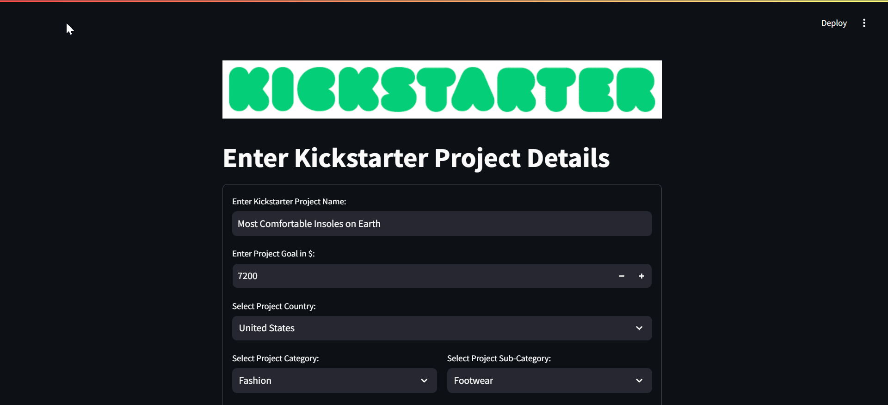
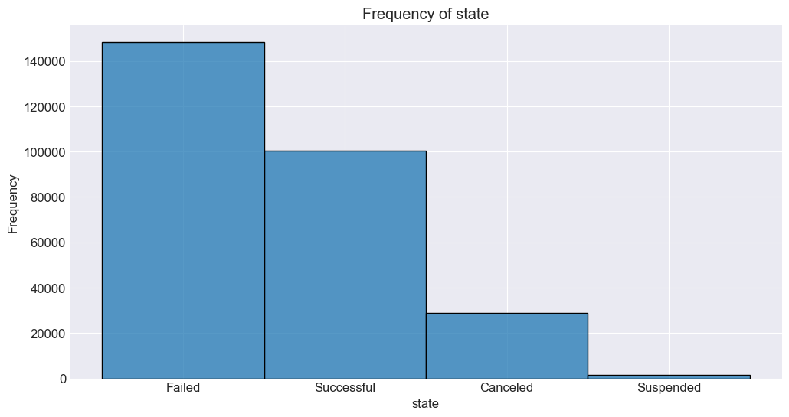
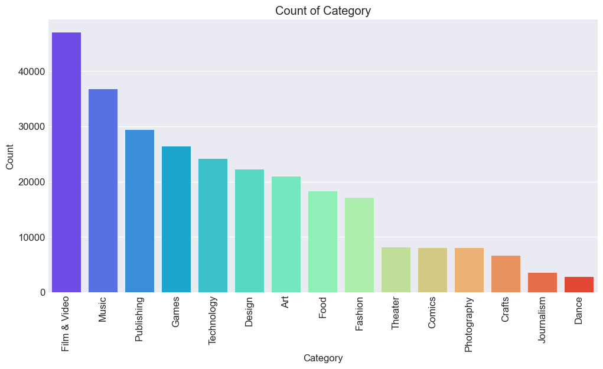
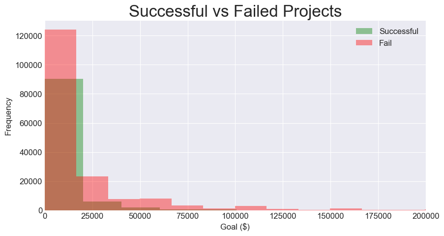

# Kickstarter machine learning project

# Introduction

💡Kickstarter is a popular crowdfunding platform that has helped thousands of entrepreneurs and creators bring their innovative ideas to life. 
However, not all Kickstarter projects are successful, and predicting which projects will succeed or fail can be valuable for both creators and investors alike.

🔗The dataset is publically available and can be accessed on Kaggle [here](https://www.kaggle.com/datasets/ulrikthygepedersen/kickstarter-projects/).

# Objective

 ❓To provide accurate predictions of project success from the perspective of a backer

# User motivation & use-case 

 ⚡Among similarly themed projects I will choose the one with the highest probability of success

 ⚡Backer use-case: What is the probability of success for a project I’m interested in? 

# Streamlit UI

The Streamlit UI allows the user to enter the details of the Kickstarter project they are considering and recieve a probability of success of failure based on the project characteristics.

# EDA

🔭 The exploratory data analysis and baseline model can be found in EDA.ipynb

## Status of projects

## Category of projects

# Baseline model

✔️ **Countries that had an average success rate over 25%: Australia, Canada, Denmark , France , Hong Kong,Ireland, Japan, New Zealand, Singapore, Sweden, Switzerland, United Kingdom and United States**

✔️ **Project categories that had an average success rate over 25%: Art, Comics, Dance, Design, Film & Video Games, Music, Photography, Publishing and Theater**

✔️ **Goal below $20,000: Most successful projects had a goal lower than $20,000**

## Baseline model results: Goal below $20,000, successful category & country. 

⚡ **Accuracy Score**: 0.58
⚡**Precision Score**: 0.45
⚡**Precision Score**: 0.45
⚡ **Recall Score**: 0.76
⚡ **F1 Score**: 0.57

# Models

Various models were trained and fitted to the data. Here is a brief description of them: 

 ⚡ **Logistic regression**: A statistical method used for binary classification problems, where the outcome is one of two possible classes. It models the probability that a given input belongs to a particular class using a logistic function.

 ⚡ **K-Nearest neighbors (KNN)**: A simple, instance-based learning algorithm used for classification and regression. It assigns a class or predicts a value based on the majority vote or average of the 'k' nearest data points in the feature space.

 ⚡ **Random forest**: An ensemble learning method that combines multiple decision trees to improve classification or regression accuracy. It builds trees on various sub-samples of the dataset and aggregates their predictions to reduce overfitting and enhance generalization.

 ⚡ **XGBoost**: A powerful gradient boosting algorithm that builds models sequentially, where each new model corrects errors made by the previous ones. It's known for its efficiency, scalability, and ability to handle large datasets, often outperforming other machine learning models in competitions.

# Model performance 

| Model          | Accuracy Score | Precision Score | Recall Score | F1 Score |
|----------------|----------------|-----------------|--------------|----------|
| knn            | 0.85           | 0.82            | 0.75         | 0.78     |
| log_reg        | 0.90           | 0.92            | 0.80         | 0.86     |
| random_forest  | 0.78           | 0.91            | 0.44         | 0.59     |
| XGBoost        | 0.94           | 0.91            | 0.92         | 0.91     |

